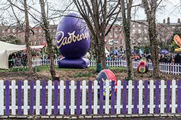
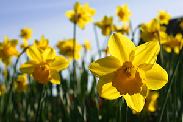
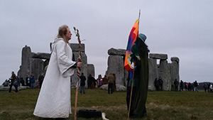

# The pagan elements of Easter

by Austin Cline

Easter is the oldest Christian holiday, but how many of the public and common celebrations of Easter today are Christian in origin? Far more people attend church than go the rest of the year but Easter candy isn’t Christian, the Easter bunny isn’t Christian and Easter eggs aren’t Christian, either. Most of what people commonly associate with Easter is pagan in origin; the rest is commercial. Just as American culture secularized Christmas, it’s secularizing Easter.

The pagan roots of Easter lie in celebrating the spring equinox, for millennia an important holiday in many religions. Celebrating the beginning of spring may be among the oldest holidays in human culture. Occurring every year on March 20, 21, or 22, the spring equinox is the end of winter and beginning of spring. Biologically and culturally, it represents for northern climates the end of a 'dead' season and the rebirth of life, as well as the importance of fertility and reproduction. The earliest reference we have to a similar holiday comes from Babylon, 2400 BCE. The city of Ur apparently had a celebration dedicated to the moon and the spring equinox which was held some time during our months of March or April.

It is believed that the Jews derived their spring equinox celebrations, the Feast of Weeks and Passover, in part from this Babylonian holiday during the period when so many Jews were held captive by the Babylonian empire. It is likely that the Babylonians were the first, or at least among the first, civilizations to use the equinoxes as important turning points in the year. Today Passover is a central feature of Judaism and Jewish faith in God.

Most cultures around the Mediterranean are believed to have had their own spring festivals: whereas in the north the vernal equinox is a time for planting, around the Mediterranean it is a time when the summer crops begin to sprout. This is an important sign of why it has always been a celebration of new life and a triumph of life over death.

A focus of spring religious festivals was a god whose own death and rebirth symbolized the death and rebirth of life during this time of the year. Many pagan religions had gods who were depicted as dying and being reborn.

Worship of Cybele and her lover Attis started in Rome around 200 BCE, and a cult dedicated to them was even located in Rome on what is today the Vatican Hill. It appears that when such pagans and early Christians lived in close proximity, they usually celebrated their spring festivals at the same time pagans honoring Attis and Christians honoring Jesus.

Nowadays, modern pagans celebrate 'Ostara' on the vernal equinox. Other names for this celebration include Eostre and Oestara and they are derived from the Anglo-Saxon lunar Goddess, Eostre.

As you might be able to guess, the name 'Easter' was likely derived from Eostre, as was the name for the female hormone estrogen. Eostre’s feast day was held on the first full moon following the vernal equinox a similar calculation to that used today for Easter among Western Christians. On this date the goddess Eostre is believed by her followers to mate with the solar god, conceiving a child who will be born nine months later on Yule, the winter solstice which falls on December 21st.

Two of Eostre’s most important symbols were the hare and the egg, which symbolized the growing possibility of new life. Each of these symbols continues to play an important role in modern celebrations of Easter.

American Christians recognize Easter as a religious holiday, but public references to Easter rarely include any religious elements. Christians and non-Christians alike celebrate Easter in decidedly non-Christian ways: with chocolate, Easter eggs, the Easter bunny, and so forth. Cultural references to Easter tend to include these elements, most of which are pagan in origin and all of which have become commercialized.
